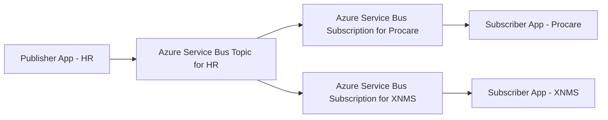

## Synchronization SDK for Go

### Overview

This repo contains:

- Reusable components
    - Models for some of the main messages used at Excitel in `pkg/message`
    - Reusable abstractions in `pkg/pubsub` to decouple the publisher/subscriber apps from Azure Service Bus
    - Implementation of the abstractions from `pkg/pubsub` using Azure Service Bus in `pkg/azure/servicebus`
- Examples
    - Publisher app that sends messages to Azure Service Bus topic in `cmd/pub`
    - Subscriber app that receives messages from Azure Service Bus subscription and prints them to the log (console) in `cmd/sub`
    - Handlers to process some of the main messages in `internal/handler`, by printing them to the log (console)

**You can import the reusable components into the publisher/subscriber app and use them "as is", or use them as examples if you prefer to create a custom implementation.**

> [!IMPORTANT]
> Implementing synchronization with a specific Excitel system means implementing handlers for some of the messages (usually events) published by that system.

Synchronization infrastructure between all systems at Excitel use the same topology:



*The arrows represent the flow of messages*

Useful documentation about Azure Service Bus and Azure SDK for Go on which this repo is based:

[Azure Service Bus documentation](https://learn.microsoft.com/en-us/azure/service-bus-messaging/service-bus-messaging-overview)

[Azure Service Bus module in Azure SDK for Go](https://github.com/Azure/azure-sdk-for-go/tree/main/sdk/messaging/azservicebus)

### Quick Start

#### Pub App

Example app that sends events to Azure Service Bus topic.

1. Add `config.env` to `cmd/pub`

```env
# cmd/pub/config.env

AZURE_SERVICEBUS_CONNECTION_STRING=<Add the connection string here>
AZURE_SERVICEBUS_NAMESPACE=<Add the namespace here>
AZURE_SERVICEBUS_TOPIC=<Add the topic here>
```

2. Run

```shell
go run cmd/pub/main.go
```

#### Sub App

Example app that receives events from Azure Service Bus subscription.

1. Add `config.env` to `cmd/sub`

```env
# cmd/sub/config.env

AZURE_SERVICEBUS_CONNECTION_STRING=<Add the connection string here>
AZURE_SERVICEBUS_NAMESPACE=<Add the namespace here>
AZURE_SERVICEBUS_TOPIC=<Add the topic here>
AZURE_SERVICEBUS_SUBSCRIPTION=<Add the subscription here>
```

2. Run

```shell
go run cmd/sub/main.go
```

### Available configuration options

Environment variables relevant to the publisher apps
| Name | Default | Optional | Description |
|--|--|--|--|
| AZURE_SERVICEBUS_CONNECTION_STRING | | | Azure Service Bus connection string. |
| AZURE_SERVICEBUS_NAMESPACE | | | Azure Service Bus namespace. |
| AZURE_SERVICEBUS_TOPIC | | | Azure Service Bus topic. |

Environment variables relevant to the subscriber apps
| Name | Default | Optional | Description |
|--|--|--|--|
| AZURE_SERVICEBUS_CONNECTION_STRING | | | Azure Service Bus connection string. |
| AZURE_SERVICEBUS_NAMESPACE | | | Azure Service Bus namespace. |
| AZURE_SERVICEBUS_TOPIC | | | Azure Service Bus topic. |
| AZURE_SERVICEBUS_SUBSCRIPTION | | | Azure Service Bus subscription. |
| AZURE_SERVICEBUS_INTERVAL | 1 minute | Yes | Time interval to pull messages from the subscription. |
| AZURE_SERVICEBUS_MESSAGES_LIMIT | 1 | Yes | Maximum number of messages to pull from the subscription. |

> [!IMPORTANT]
> AZURE_SERVICEBUS_INTERVAL and AZURE_SERVICEBUS_MESSAGES_LIMIT environment variables are the means of tuning the performance of subscriber apps.