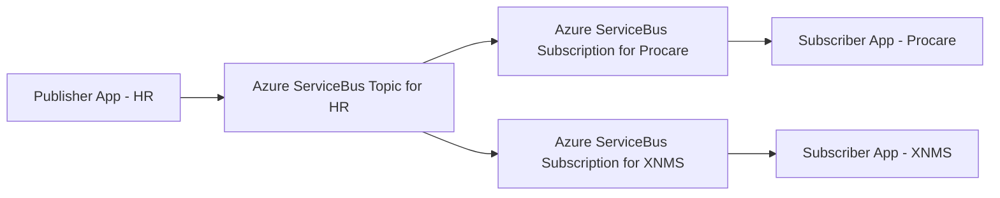

## Synchronization SDK for Go

### Overview

All systems at Excitel use the same topology:


This repo contains:

- Reusable components
    - Models for some of the important messages used at Excitel in pkg/message
    - Reusable abstractions in pkg/pubsub to decouple the publisher/subscriber apps from Azure ServiceBus
    - Implementation of the abstractions from pkg/pubsub using Azure Service Bus in pkg/azure/servicebus
- Examples
    - Publisher app that sends messages to Azure ServiceBus topic in cmd/pub
    - Subscriber app that receives messages from Azure ServiceBus subscription and prints them in the log in cmd/sub
    - Handlers to process some of the important messages in internal/handler, by dumping them to the console

**The reusable components can be imported into the publisher/subscriber app and used "as is", or they can be used as examples if custom implementation is required.**

Useful documentation about Azure ServiceBus and Azure SDK for Go:

[Azure ServiceBus documentation](https://learn.microsoft.com/en-us/azure/service-bus-messaging/service-bus-messaging-overview)

[Azure ServiceBus module in Azure SDK for Go](https://github.com/Azure/azure-sdk-for-go/tree/main/sdk/messaging/azservicebus)

### Quick Start

#### Pub 

Example app that sends events to Azure ServiceBus topic.

1. Add config.env to cmd/pub

```env
# cmd/pub/config.env

AZURE_SERVICEBUS_CONNECTION_STRING=<Add the connection string here>
AZURE_SERVICEBUS_NAMESPACE=<Add the namespace here>
AZURE_SERVICEBUS_TOPIC=<Add the topic here>
```

2. Run

```shell
go run cmd/pub/main.go
```

#### Sub

Example app that receives events from Azure ServiceBus subscription.

1. Add config.env to cmd/sub

```env
# cmd/sub/config.env

AZURE_SERVICEBUS_CONNECTION_STRING=<Add the connection string here>
AZURE_SERVICEBUS_NAMESPACE=<Add the namespace here>
AZURE_SERVICEBUS_TOPIC=<Add the topic here>
AZURE_SERVICEBUS_SUBSCRIPTION=<Add the subscription here>
```

2. Run

```shell
go run cmd/sub/main.go
```

### Available configuration options

Environment variables relevant to the publisher apps
| Name | Default | Optional | Description |
|--|--|--|--|
| AZURE_SERVICEBUS_CONNECTION_STRING | | | Azure ServiceBus connection string. |
| AZURE_SERVICEBUS_NAMESPACE | | | Azure ServiceBus namespace. |
| AZURE_SERVICEBUS_TOPIC | | | Azure ServiceBus topic. |

Environment variables relevant to the subscriber apps
| Name | Default | Optional | Description |
|--|--|--|--|
| AZURE_SERVICEBUS_CONNECTION_STRING | | | Azure ServiceBus connection string. |
| AZURE_SERVICEBUS_NAMESPACE | | | Azure ServiceBus namespace. |
| AZURE_SERVICEBUS_TOPIC | | | Azure ServiceBus topic. |
| AZURE_SERVICEBUS_SUBSCRIPTION | | | Azure ServiceBus subscription. |
| AZURE_SERVICEBUS_INTERVAL | 1 minute | Yes | Time interval to pull messages from the subscription. |
| AZURE_SERVICEBUS_MESSAGES_LIMIT | 1 | Yes | Maximum number of messages to pull from the subscription. |

> [!IMPORTANT]
> AZURE_SERVICEBUS_INTERVAL and AZURE_SERVICEBUS_MESSAGES_LIMIT environment variables are the means of tuning the performance of subscriber apps.